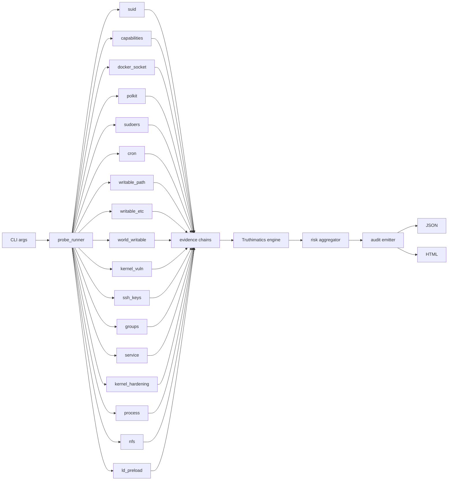
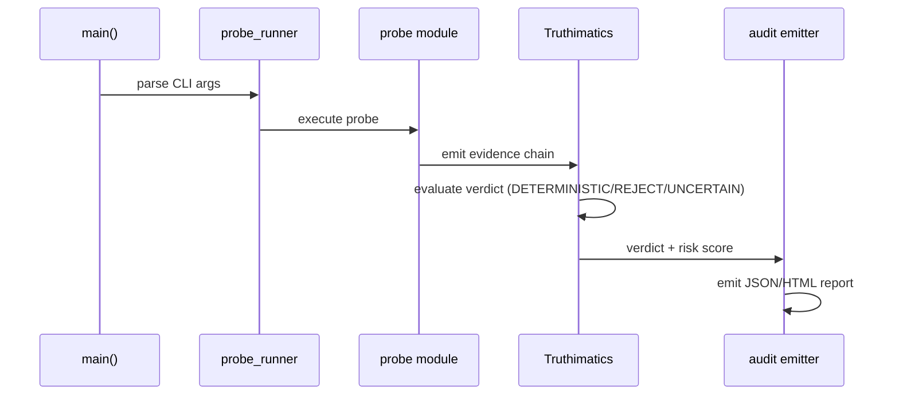

<div align="center">
  
  <h1>Z-Privesc</h1>
  <p>
    Linux privilege-escalation auditor. Seventeen probes.<br/>
    Deterministic verdicts. Honest accuracy numbers.
  </p>
  
  
  
  
  
</div>

---

```text
┌──────────────────────────────────────────────────────┐
│                   Z-Privesc                          │
├──────────────────────────────────────────────────────┤
│  suid              SUID/SGID binary audit            │
│  capabilities      File/process Linux capabilities   │
│  docker_socket     Exposed Docker control socket     │
│  polkit            polkit/pkexec misconfigurations   │
│  sudoers           Sudoers rule audit                │
│  cron              Cron job misconfigurations        │
│  writable_path     World-writable $PATH entries      │
│  writable_etc      Writable /etc auth files          │
│  world_writable    World-writable sensitive files    │
│  kernel_vuln       Kernel version CVE matcher        │
│  ssh_keys          SSH private key permissions       │
│  groups            Privileged group membership       │
│  service           Systemd/SysV unit audit           │
│  kernel_hardening  Weak sysctl values                │
│  process           Root process binary audit         │
│  nfs               NFS export misconfigurations      │
│  ld_preload        LD_PRELOAD/ld.so.conf audit       │
└──────────────────────────────────────────────────────┘
```

---

## Table of Contents

- [Quick Start](#quick-start)
- [Why Z-Privesc](#why-z-privesc)
- [Architecture](#architecture)
- [Probes](#probes)
- [Verdict Engine](#verdict-engine)
- [Accuracy](#accuracy)
- [Usage](#usage)
- [Build & Install](#build--install)
- [Testing](#testing)
- [Feature Comparison](#feature-comparison)
- [Threat Model](#threat-model)
- [Documentation](#documentation)
- [Roadmap](#roadmap)
- [License](#license)

---

## Quick Start

```sh
git clone https://github.com/Division-36/Z-Privesc
cd Z-Privesc
make
./build/bin/z_privesc --all --json | jq
```

---

## Why Z-Privesc

Existing privilege-escalation auditors make trade-offs:

|                      | **Z-Privesc** | **LinPEAS** | **Lynis** | **linux-exploit-suggester** |
|----------------------|:-------------:|:-----------:|:---------:|:---------------------------:|
| Static binary        | **Yes**       | No          | No        | No                          |
| Zero external deps   | **Yes**       | No          | No        | No                          |
| Deterministic verdicts| **Yes**      | No          | No        | No                          |
| CVSS-like risk scoring| **Yes**      | No          | No        | No                          |
| 17 categories OOTB   | **Yes**       | Broad       | Broad     | Partial                     |
| Machine-readable JSON| **v1**        | None        | None      | None                        |
| Per-finding remediation| **Yes**     | Partial     | No        | No                          |
| Offline/air-gapped   | **Yes**       | Yes         | Yes       | Yes                         |
| License              | MIT           | GPL-3       | GPL       | MIT                         |

Z-Privesc fills the niche between broad compliance scanners (Lynis, LinPEAS)
and narrow exploit suggesters. It answers one question: **can an unprivileged
user on this box get root, right now?**

---

## Architecture

### Data Flow



### Probe Pipeline



---

## Probes

| # | Name | What it checks | Severity |
|---|------|---------------|----------|
| 1 | `suid` | SUID/SGID binaries | CRITICAL |
| 2 | `writable_path` | World-writable $PATH entries | CRITICAL |
| 3 | `capabilities` | File/process Linux capabilities | HIGH |
| 4 | `writable_etc` | Writable /etc auth files | CRITICAL |
| 5 | `docker_socket` | Exposed Docker control socket | CRITICAL |
| 6 | `polkit` | polkit/pkexec misconfigurations | CRITICAL |
| 7 | `world_writable` | World-writable sensitive files | CRITICAL |
| 8 | `kernel_vuln` | Kernel version CVE matcher | CRITICAL |
| 9 | `cron` | Cron job misconfigurations | CRITICAL |
| 10 | `sudoers` | Sudoers rule audit | CRITICAL |
| 11 | `ssh_keys` | SSH private key permissions | HIGH |
| 12 | `groups` | Privileged group membership | CRITICAL |
| 13 | `service` | Systemd/SysV unit audit | CRITICAL |
| 14 | `kernel_hardening` | Weak sysctl values | MEDIUM |
| 15 | `process` | Root process binary audit | HIGH |
| 16 | `nfs` | NFS export misconfigurations | CRITICAL |
| 17 | `ld_preload` | LD_PRELOAD/ld.so.conf audit | CRITICAL |

See [docs/PROBES.md](docs/PROBES.md) for rationale and false-positive mitigations.

---

## Verdict Engine

The Truthimatics engine assigns each evidence chain one of three verdicts:

| Verdict | Meaning |
|---------|---------|
| **DETERMINISTIC** | Confirmed privilege-escalation path |
| **REJECT** | No vulnerability found by this probe |
| **UNCERTAIN** | Suspicious but not conclusive |

Risk is scored 0.0--10.0 (CVSS-like) with per-finding, per-probe,
and system-wide labels: `INFO` / `LOW` / `MEDIUM` / `HIGH` / `CRITICAL`.

See [docs/TRUTHIMATICS.md](docs/TRUTHIMATICS.md) for the full specification.

---

## Accuracy

Measured against a 37-target ground-truth corpus across two distros
(Kali WSL2 + Ubuntu 26.04 multipass):

| Metric | Value |
|--------|-------|
| Detection recall | **1.000** (37/37) |
| Path recall | **0.943** (33/35) |
| Path precision | **0.971** (33/34) |
| False positives on planted targets | **0** |
| Brier score | 0.109 |
| Scan time (full) | 2.65 s |
| Observations | 353 |
| GTFOBins knowledge coverage | 0.8649 (32/37) |

### Head-to-head (same Ubuntu 26.04 VM)

| Tool | Version | Scan time | Output |
|------|---------|-----------|--------|
| **Z-Privesc** | 1.0.0 | **2.65 s** | 40 structured findings |
| Lynis | 3.1.6 | 100.45 s | 850 lines |
| LinPEAS | latest | 120.03 s | 378 lines |

See [benchmarks.md](benchmarks.md) for full methodology and
[docs/EVALUATION.md](docs/EVALUATION.md) for reproduction.

---

## Usage

```text
z_privesc [--all] [--probe=<name>] [--json] [--verbose] [--version] [--help]
```

| Flag | Description |
|------|-------------|
| `--all` | Run all 17 probes |
| `--probe=<name>` | Run a single probe (repeatable) |
| `--json` | Output findings as JSON |
| `--verbose` | Enable debug logging |
| `--version` | Show version and exit |
| `--help` | Show usage and exit |

### Examples

```sh
# Run all probes with JSON output
./build/bin/z_privesc --all --json | jq

# Run a single probe
./build/bin/z_privesc --probe=suid

# Verbose mode for debugging
./build/bin/z_privesc --all --verbose
```

### Exit Codes

| Code | Meaning |
|------|---------|
| 0 | No privilege-escalation paths found |
| 1 | Probe execution error |
| 2 | At least one DETERMINISTIC finding |
| 125 | Internal error |

---

## Build & Install

### Requirements

- Linux kernel >= 5.4
- GCC >= 9 (tested on 9.4, 12.2, 15.2)
- No external libraries -- just the standard C toolchain

### Commands

```sh
make              # build binary
make test         # unit tests (58/58)
make test-full    # integration tests (requires root in VM)
make static       # portable static binary
make coverage     # gcov coverage report
make install      # install to /usr/local + man page
make clean        # remove build artifacts
```

The binary is built as a Position Independent Executable with
`-fstack-protector-strong`, `-D_FORTIFY_SOURCE=2`, full RELRO,
and `-z now`.

### Compile-time Options

```sh
make CC=clang CFLAGS="-O3 -march=native"   # custom compiler/flags
```

---

## Testing

### Quick Test (no root)

```sh
make test         # 58 unit tests
```

These don't need root and run in under 1 second.

### Full Test Suite

```sh
make test-full    # integration tests (requires root in VM)
```

Requires root for probing system state. The test suite covers:

| # | Test | What it tests |
|---|------|---------------|
| 1-58 | Unit tests | Probe logic, truthimatics engine, risk scoring |
| 1-37 | Integration tests | Real-world probes against ground-truth corpus |

---

## Feature Comparison

| Capability | Z-Privesc | LinPEAS | Lynis |
|-----------|:---------:|:-------:|:-----:|
| Static binary, zero deps | Yes | No | No |
| Deterministic verdicts | Yes | No | No |
| CVSS-like risk scoring | Yes | No | No |
| 17 categories out of the box | Yes | Broad | Broad |
| Machine-readable schema (JSON) | v1 | None | None |
| Per-finding remediation | Yes | Partial | No |
| Offline/air-gapped | Yes | Yes | Yes |
| License | MIT | GPL-3 | GPL |

---

## Threat Model

### In Scope
- Local unprivileged user on a Linux host
- Privilege escalation to root via misconfiguration
- SUID, capabilities, sudo, cron, Docker, polkit, NFS, kernel vulns

### Out of Scope
- Remote attacks
- Kernel exploit reliability
- Side channels
- Denial of service

---

## Documentation

| File | Description |
|------|-------------|
| `README.md` | This file |
| `docs/ARCHITECTURE.md` | System design |
| `docs/PROBES.md` | Probe rationale and design |
| `docs/TRUTHIMATICS.md` | Verdict engine specification |
| `docs/COMPOSITION.md` | Exploitability graph |
| `docs/EVALUATION.md` | Reproduction guide |
| `benchmarks.md` | Full benchmark data |
| `docs/RELATED-WORK.md` | Related work |
| `docs/adr/` | Architecture Decision Records (4 docs) |
| `man/z_privesc.1` | Man page |
| `SECURITY.md` | Security policy and reporting |
| `CONTRIBUTING.md` | How to contribute |
| `CHANGELOG.md` | Release history |
| `ROADMAP.md` | Future plans |
| `HISTORY.md` | Development timeline |

---

## Roadmap

### v1 (current)
- 17 privilege-escalation probes
- Truthimatics verdict engine
- JSON/HTML audit output
- 58 unit tests + 37-target ground-truth corpus
- Man page, completions (bash, zsh, fish)

### v2 (planned)
- Remote network probing
- Custom probe plugins
- CIS/DISA STIG integration
- Cross-distro kernel CVE database
- Release signing (minisign)

---

## Security

Report security issues to
[zs.01117875692@gmail.com](mailto:zs.01117875692@gmail.com).
See [SECURITY.md](SECURITY.md) for disclosure policy.

---

## License

**MIT** -- see `LICENSE` for the full text.

---

*Z-Privesc was built on WSL2 (Kali Linux, GCC 15.2.0), targeting Linux 5.4+.*
*Maintained by [Division-36](https://github.com/Division-36). Report issues at the [issue tracker](https://github.com/Division-36/Z-Privesc/issues).*
